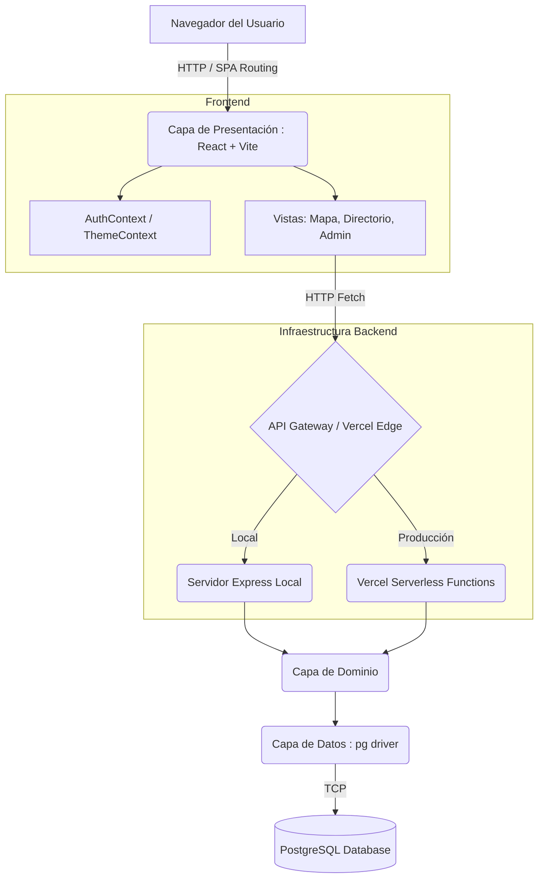
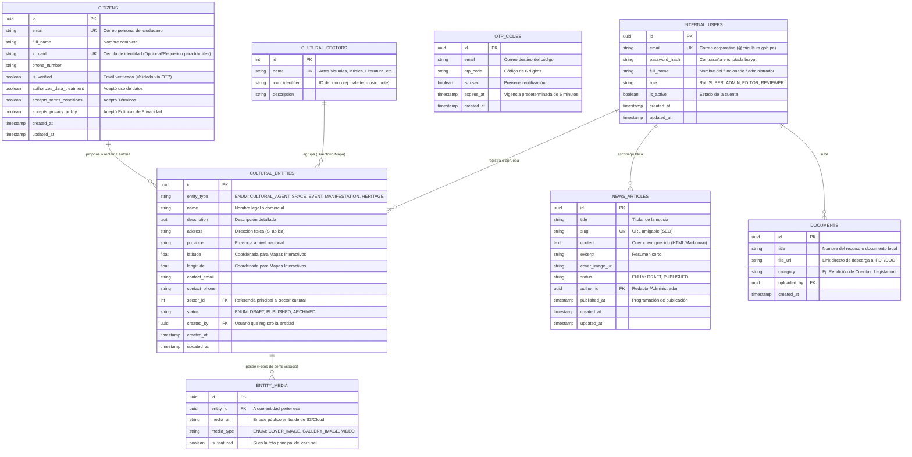

# Requerimientos del Sistema

Este documento define la base de los requerimientos funcionales y no funcionales que la plataforma "Ministerio de Cultura de Panamá" está diseñada para cumplir.

## Requerimientos Funcionales

Los requerimientos funcionales detallan los casos de uso específicos que los usuarios interactuando con el sistema podrán efectuar.

1. **Gestión de Identidad y Acceso (Roles)**
   - El sistema debe permitir inicio de sesión protegido por credenciales cifradas para usuarios de tipo "Administrador" (Dashboard administrativo).
   - El sistema debe mantener sesiones activas mediante JSON Web Tokens (JWT).

2. **Exploración del Directorio Cultural**
   - El sistema debe ofrecer un Directorio de Agentes y Espacios Culturales (`/directorio`).
   - El ecosistema debe proporcionar un carrusel interactivo que permita filtrar datos por "Sectores Culturales" (Ej: Artes Visuales, Música, Literatura).

3. **Mapas Interactivos**
   - El sistema debe renderizar un mapa público interactivo (`/mapa`) que posicione eventos y espacios culturales geolocalizados a nivel nacional.
   - El mapa debe disponer de filtros categorizados similares a los del directorio.

4. **Visualización de Estadísticas**
   - El portal debe presentar métricas, indicadores o cuadros de mando (`/estadisticas`) sobre el impacto de la gestión del Ministerio.

5. **Noticias y Novedades**
   - El sistema debe contar con un panel paginado e interactivo para visualizar artículos, notas de prensa y noticias destacadas (`/novedades`).

6. **Preferencias Globales del Usuario**
   - El portal debe permitir el intercambio fluido, a decisión del usuario, entre temas visuales Oscuro ("Dark Mode") y Claro ("Light Mode"). Las preferencias deben recordarse a nivel almacenamiento de navegador (LocalStorage).

## Requerimientos No Funcionales

Restricciones, cualidades de arquitectura y métricas de calidad que el ecosistema debe aplicar.

1. **Seguridad**
   - **Autenticación Fuerte**: Las contraseñas en la capa transaccional deben protegerse usando hashes aleatorios `Bcrypt`.
   - **Prevensión de Exposición**: Toda comunicación clave del backend que exponga la base de datos debe ser blindada, usando rutas de la API en el servidor u operando mediante patrones "Proxy" que oculten API keys de terceros.

2. **Desempeño y Experiencia de Usuario (UX)**
   - **SPA Responsivo**: El cambio de páginas debe ejecutarse sin recarga completa del navegador mediante ruteo a nivel del cliente web (React Router DOM).
   - **Animaciones Suaves y Feedback Visua**l: Debe implementar una estrategia `animate-on-scroll` garantizando que los bloques surjan conforme se navega.

3. **Escalabilidad, Portabilidad y Despliegue**
   - **Despliegue Habilitado sin Servidor Central**: El Backend no debe depender de máquinas de estado fijas, admitiendo funciones sin estado autoejecutables en servicios en la nube (Serverless Functions) para tolerancia a altos picos de tráfico.
   - **Neutralidad de Entornos**: Deberá comportarse de forma simétrica e infalible tanto en un entorno local de ejecución (`Express`) como en la provisión final de Vercel.
# Arquitectura del Sistema

El proyecto "Ministerio de Cultura de Panamá" está diseñado en base a los principios de **Clean Architecture** (Arquitectura Limpia), combinada con un enfoque híbrido de despliegue que soporta tanto un servidor monolítico como funciones Serverless.

## Visión General del Diseño

El sistema opera bajo un flujo de separación de responsabilidades estricto, aislando la interfaz de usuario de las reglas de negocio y de los canales de persistencia de datos (PostgreSQL).

### Capas Arquitectónicas

1. **Capa de Presentación (`src/presentation`)**:
   - Construida como una Single Page Application (SPA) utilizando **React** y **Vite**.
   - Gestiona todo el enrutamiento visual usando `react-router-dom`.
   - Incluye componentes visuales, páginas (Home, Mapa, Directorio) y Contextos de React (`AuthContext`, `ThemeContext`).
   - No contiene reglas de negocio.

2. **Capa de Dominio (`src/domain`)**:
   - Contiene la lógica central del negocio y los modelos de datos de la plataforma.
   - Es totalmente agnóstica a la base de datos o al framework de la interfaz usuaria.

3. **Capa de Datos (`src/data`)**:
   - Contiene las implementaciones para conexiones externas, particularmente consultas SQL seguras mediante la librería `pg` para PostgreSQL.

4. **Capa de Infraestructura y Servicios API (`src/server` y `api/`)**:
   - Expone los casos de uso a través del protocolo HTTP.
   - En **local**, opera como un servidor `Express.js` clásico.
   - En **producción**, opera empacado en enrutadores Serverless Vercel (`api/*.ts`).

## Diagrama de Componentes y Flujo de Datos



## Patrones de Diseño Implementados
- **Gestión de Estado Global**: Context API para el estado de autenticación (JWT) y preferencias del usuario (Dark Mode).
- **Backend For Frontend (BFF)**: Las serverless functions (como `/api/proxy`) se utilizan para evitar CORS y pre-procesar data antes de que llegue a React.
# Registro de Cambios (Changelog)

Todos los cambios, refactorizaciones y avances notables de este proyecto de ingeniería serán documentados en este archivo.

El formato que utilizamos se fundamenta fuertemente en [Keep a Changelog](https://keepachangelog.com/es-ES/1.0.0/), y este equipo sigue el versionado [SemVer](https://semver.org/lang/es/) para numerar los lanzamientos de cara al usuario.

---

## [0.1.0-alpha] - 2026-02-27

### Añadido (Added)
- Nueva iniciativa Documentación Código (`Documentation As Code`): Adición de repositorios de infraestructura como `ARCHITECTURE.md`, `TECH_STACK.md`, `REQUIREMENTS.md`, `CONTRIBUTING.md`, `SECURITY.md`.
- Implementación de flujos de Registro e Inicio de Sesión mediante códigos de verificación de un solo uso (OTP) al correo electrónico para mejorar la experiencia y seguridad (eliminando el uso de contraseñas locales).
- Primer andamiaje del área administrativa (`Backoffice`) con enrutamiento protegido mediante JSON Web Tokens (JWT) y decodificación en frontend del nombre de usuario.
- Implementación base de contexto React global `ThemeContext` y el componente individual `ThemeToggle` para controlar las variantes Claro/Oscuro en la paleta de colores.
- Configuración fundamental `vercel.json` y `api/package.json` para facilitar un flujo nativo continuo a la infraestructura "Functions" de Vercel.

### Modificado (Changed)
- Las etiquetas de links nativos `<a>` en casi todos los componentes (tales como `Home`, `News`, `Directory`, y `Documents`) fueron cambiadas permanentemente por `<Link>` utilizando  `react-router-dom` a efectos de promover Single Page Applications limpias e instantáneas.
- Redireccionamiento generalizado de las importaciones del footer: De `sobre_sicultura.html` al enrutador moderno React de `/sobre`.
- Corrección de la propiedad CSS `@custom-variant dark` dentro del compilador original `Tailwind v4` para permitir los re-estilos visuales manuales desde el front.

### Corregido (Fixed)
- Solucionada visibilidad de elementos asincronos afectados por la clase CSS vacía `animate-on-scroll` distribuyendo el uso pragmático de un interceptor DOM `IntersectionObserver`.
- Subsanado problema crítico (`TypeError: Destructuring req.body Cannot read properties of undefined`) pre-visualizado en respuestas 500 del servidor Vercel.
- Resuelto bloqueo en los carretes modulares o `Carousels` estáticos introduciendo referencias (refs) de Desplazamientos JSX sobre los ejes absolutos X de componentes directores como *Carrusel de Categorías* (`Directory`, `Map`).
# Ministerio de Cultura de Panamá


Portal web y sistema de gestión para el **Ministerio de Cultura de Panamá (MiCultura)**. Esta plataforma integra un directorio cultural, mapas interactivos, visualización de estadísticas, gestión documental y un panel de administración seguro administrado mediante Clean Architecture.

## 🚀 Estado de Construcción

Actualmente el proyecto se encuentra en la versión **0.1.0-alpha**.
- **Frontend:** Estructura de vistas completada (Home, Directorio, Mapa, Estadísticas, Novedades, Documentos, Sobre Sicultura). Integración de Dark Mode global vía React Context y componentes de autenticación dinámica (LoginModal, RegistrationModal).
- **Backend:** Servicios API base configurados de forma híbrida (Express local y Serverless Functions en Vercel). Funciones de Autenticación sin contraseña (OTP vía Email) y Proxy estabilizadas con soporte CommonJS. Enrutamiento del Backoffice protegido por JWT.
- **Base de Datos:** Configuración inicial con PostgreSQL mapeada en la capa de datos. Tablas de Ciudadanos (CITIZENS) y validación de OTP (OTP_CODES) implementadas y funcionales.

## 📦 Guía Rápida de Instalación

### Prerrequisitos
- Node.js (v18 o superior recomendado)
- PostgreSQL (para la base de datos local)

### Configuración del Entorno local
1. Clona el repositorio:
   ```bash
   git clone https://github.com/cabepi/panama_min_cultura.git
   cd panama_min_cultura
   ```
2. Instala las dependencias:
   ```bash
   npm install
   ```
3. Configura las variables de entorno. Copia el archivo de ejemplo y ajusta los valores:
   ```bash
   cp .env.example .env
   ```

### 🛠 Comandos de Desarrollo

El proyecto está configurado para ejecutar de forma concurrente el frontend (Vite) y el backend local (Express) con un solo comando:

```bash
# Iniciar frontend y backend en entorno de desarrollo (con recarga en vivo)
npm run dev

# Compilar para producción (TypeScript + Vite build)
npm run build

# Previsualizar el build de producción localmente
npm run preview
```

## 📚 Estructura Principal
El código se organiza siguiendo principios de Clean Architecture:
- `src/presentation/`: Componentes de React, Páginas, Contextos de estado global (`Auth`,`Theme`).
- `src/domain/`: Lógica de negocio y definiciones de entidades TypeScript.
- `src/data/`: Acceso a la base de datos y servicios externos.
- `src/server/`: Servidor Express de desarrollo local.
- `api/`: Funciones Serverless nativas para la plataforma de Vercel.

### Documentación del Proyecto
- [Arquitectura Detallada (ARCHITECTURE.md)](./ARCHITECTURE.md)
- [Esquema de Base de Datos (DATABASE.md)](./DATABASE.md)
- [Stack Tecnológico (TECH_STACK.md)](./TECH_STACK.md)
- [Requerimientos (REQUIREMENTS.md)](./REQUIREMENTS.md)
- [Guía de Contribución (CONTRIBUTING.md)](./CONTRIBUTING.md)
- [Políticas de Seguridad (SECURITY.md)](./SECURITY.md)
- [Registro de Cambios (CHANGELOG.md)](./CHANGELOG.md)

---
*Desarrollado para el Ministerio de Cultura de Panamá.*
# Guía de Contribución (CONTRIBUTING)

¡Gracias por tu interés en contribuir al "Ministerio de Cultura de Panamá"! 

Aspiramos a que este proyecto crezca como un software ordenado, predecible y altamente sostenible. Por esta razón, hemos estipulado este manual de operación para todos los ingenieros que formen parte del equipo.

## 1. Flujo de Trabajo con Ramas (Git Flow)

Adoptamos una versión adaptada de **Git Flow** para el control de versiones:
- **`main`**: Es la única rama que refleja el estado real en Producción. Por motivos de configuración continua (CI/CD en Vercel) ningún desarrollador hace *push* directo a `main`.
- **`develop`**: Es la rama de integración donde residen todas las características recién implementadas antes de una versión (`release`).
- Ramas de características (`feature/nombredelatarea`): Todas las nuevas contribuciones nacen derivándose desde `develop`. Una vez finalizada la prueba funcional, se hace un "Merge Request/Pull Request" hacia `develop`.
- Ramas de arreglos `fix/...` o `hotfix/...`: Siguen la misma lógica que los *features*, destinándose a mitigaciones rápidas.

> **Regla de Oro**: Siempre haz *pull* de la rama origen (sea main o develop) antes de crear la tuya. Mantén tu repositorio local sincronizado.

## 2. Estándares para el Formato de Commits

La historia de los cambios y aportes debe ser analógica a la documentación legible para un humano. Exigimos seguir la convención **Conventional Commits**.

**Formato Fijo:**
`<tipo>[alcance opcional]: <descripción imperativa>`

**Tipos Reconocidos en el Proyecto:**
- `feat`: Introduce una nueva característica orientada a negocio.
- `fix`: Resuelve un defecto comprobable (Bug) en el código.
- `docs`: Abarca cambios exclusivos de los archivos `.md` de documentación.
- `style`: Formateo de las sentencias del código de acuerdo al linter (Ej: Eslint, tabulaciones, no añade lógica).
- `refactor`: Limpieza que no implica agregar nuevos features ni arreglar bugs explícitos.
- `perf`: Rediseño de una porción de código destinada exclusivamente a que el programa vaya más deprisa o consuma menos.
- `test`: Tareas de verificación (unit tests).
- `chore`: Modificaciones de mantenimiento, tooling o configuración de empaquetadores (vite, npm dependencias).

**✅ Ejemplos Correctos:**
- `feat(auth): Integrate bcrypt middleware for user registration`
- `fix(ui): Correct category carousel scroll ref mapping`
- `docs: Create architecture markdown overview`

**❌ Ejemplos Incorrectos (Serán Rechazados):**
- `cambios en el login lol`
- `update`
- `fixed dark mode`

## 3. Normas de Estilo y Código

Este repositorio utiliza el sistema de tipado estricto `TypeScript` de la mano con `ESLint`. Sigue estas reglas al codificar:

- **Escribe todo el código base en inglés** (nombres de variables, clases funcionales, nombres de tablas, columnas asíncronas). Mantén el español explícitamente contenido a la interfaz visual (textos, modales HTML, logs hacia el cliente final, descripciones en Bases de datos).
- Jamás manipules el DOM directamente con selectores tradicionales como `document.querySelectorAll()` salvo que sea estrictamente ineludible. Deben priorizarse los `Hooks` y `useRefs` de React.
- Extrae toda la lógica compleja en *Hooks* personalizados (`useTheme`, `useAuth`) para que los componentes UI mantengan su principio de responsabilidad única.

Recomendamos utilizar Extensiones de "Autoforma" en editores base y cerciorarse de correr `npm run lint` antes de consolidar el cambio permanentemente.
# Stack Tecnológico

Este documento define las tecnologías exactas, lenguajes, frameworks y dependencias utilizadas en el desarrollo de la plataforma, extraídas de la configuración de construcción actual del repositorio.

## Base y Runtime
| Tecnología | Versión / Detalle | Propósito |
| :--- | :--- | :--- |
| **Node.js** | Entorno Local | Runtime de JavaScript en el lado del servidor y herramientas de compilación. |
| **TypeScript** | `~5.9.3` | Lenguaje principal de todo el repositorio (Frontend, Backend, y Configuración). Transpilador de tipado estricto. |

## Capa Frontend (Presentación)
| Tecnología | Versión / Detalle | Propósito |
| :--- | :--- | :--- |
| **React** | `^19.2.0` | Librería principal para la construcción de la interfaz de usuario. |
| **React DOM** | `^19.2.0` | Renderizador web para React. |
| **Vite** | `^7.3.1` | Empaquetador y servidor de desarrollo ultra rápido con soporte de Hot-Module Replacement (HMR). |
| **React Router DOM** | `^7.13.1` | Enrrutador oficial de la aplicación (Single Page Application). |
| **Tailwind CSS** | `^4.2.1` | Framework CSS utilitario. Configurado globalmente vía `@tailwindcss/vite`. |
| **Lucide React** | `^0.575.0` | Paquete de iconos SVG escalables consistentes. |

## Capa Backend e Infraestructura
| Tecnología | Versión / Detalle | Propósito |
| :--- | :--- | :--- |
| **Express** | `^5.2.1` | Framework backend minimalista utilizado para el entorno local. |
| **PostgreSQL (`pg`)** | `^8.19.0` | Cliente oficial de Node.js para interactuar con la base de datos PostgreSQL. |
| **JSON Web Token (JWT)**| `^9.0.3` | Generación y validación de tokens seguros de autenticación para protección de rutas. |
| **Bcrypt.js** | `^3.0.3` | Encriptación (hashing) algorítmica y salting de contraseñas de administrador. |
| **Cors** | `^2.8.6` | Middleware de Express para permitir el Intercambio de Recursos de Origen Cruzado. |
| **Dotenv** | `^17.3.1` | Carga variables de entorno críticas desde arreglos `.env`. |

## Herramientas de Desarrollo (DevTools)
| Tecnología | Versión / Detalle | Propósito |
| :--- | :--- | :--- |
| **ESLint** | `^9.39.1` | Linter modular del código base mediante reglas estáticas para TypeScript y React Hooks. |
| **TSX / TS-Node** | `^4.21.0` / `^10.9.2` | Ejecuta de forma directa los archivos `.ts` de node sin una transpilación pre-hecha. |
| **Concurrently** | `^9.2.1` | Permite arrancar y mantener vivo tanto Vite (Frontend) como Express (Backend local) con un solo comando. |

## Plataforma y Despliegue
- **Hosting / CI-CD**: **Vercel**. El sistema utiliza el entorno Edge de Vercel para servir las vistas estáticas del Frontend de React, operando su lógica de negocio de Backend sobre infraestuctura **Serverless** (`Vercel Functions`) que corren en Node (CommonJS mapping configurado en `api/`).
# Política de Seguridad

El equipo de infraestructura del **Ministerio de Cultura de Panamá** toma seriamente la confidencialidad de la información y la integridad e invulneración operacional de toda la plataforma de código abierto desarrollada.

## Versiones Soportadas

Actualmente, solo las construcciones consolidadas marcadas como **Último Release Estable** reciben retroalimentación y actualizaciones críticas por parte de los ingenieros centrales. Las versiones catalogadas como "Alpha" o "Beta" continúan considerándose bajo inestabilidad potencial.

| Versión | Perfil | Estado de Soporte Activo |
| ------- | :---: | :----------------------: |
| 1.0.x   | Producción | ❌  No publicada todavía  |
| **0.1.x**   | **Alpha Core** | **✅ Total**                    |

## Cómo Reportar una Vulnerabilidad

> [!NOTE]
> **Arquitectura Passwordless (Sin Contraseña):**  
> Para mitigar vectores severos de filtrado masivo ("Data Breaches"), robos por fuerza bruta y reciclamiento de contraseñas cruzadas, este proyecto ha optado desde la base (`v0.1.0`) por eliminar el almacenamiento local de cadenas estáticas e `hashes` bcrypt. Toda la identificación y autorización del ciudadano o administradores es despachada exclusivamente mediante envío efímero de Correos de Contraseña Única (Código OTP) e intercambio directo por JSON Web Tokens temporales, caducando a los 5 minutos y 24 horas, respectivamente.

Si un experto tecnológico, investigador de ciberseguridad o un usuario identifica deficiencias potenciales u hoyos de explotación (tales como `Inyección SQL`, vulneración `Cross-Site Scripting XSS`, fugas de Expiración en tokens JWT, saltos y falsificaciones `CSRF`), **solicitamos encarecidamente NO generar "Issues" abiertos dentro del rastreador público del repositorio.**

Procedimiento de reporte oficial:
1. Contactar urgentemente en privado al Líder Técnico de Repositorio o mantenedor directo enviando un correo con los detalles probatorios. (Correo *Pendiente de Definición Gubernamental*).
2. Asegurar en el mensaje de correo evidencia adjunta, los pasos analíticos exactos para reproducir empíricamente el modelo fallido, y la potencial severidad técnica que acarrea la brecha. 
3. El equipo acusará recibo en un plazo no mayor a **48 horas laborables**, iniciando la apertura de una rama de contención confidencial inmediata (`hotfix-security`) para blindar el error antes de que el público lo adquiera mediante un parche retroactivo de urgencia.

Toda contribución que preserve el entorno neutral y fiable de MiCultura agradece una acción discreta y pragmática.
# Arquitectura de Datos (Diagrama Entidad-Relación)

Con base en los **Requerimientos Funcionales** levantados (Directorio Cultural, Mapas Interactivos, Gestión de Identidad y Novedades), este documento expone el diseño del esquema relacional que soporta la base de datos **PostgreSQL**.

## Diagrama Entidad-Relación (ERD)

Este modelo conceptual utiliza las convenciones de `Mermaid` para ilustrar las relaciones entre las entidades fundamentales requeridas por la plataforma del Ministerio de Cultura.



## Diccionario de Entidades Clave

1. **`INTERNAL_USERS` (Gestión Administrativa Interna):** 
   - Soporta exclusivamente a los funcionarios del Ministerio de Cultura. Tienen roles estrictos (`SUPER_ADMIN`, `EDITOR`) y son los únicos con permisos para publicar noticias, subir documentos legales y aprobar/rechazar entidades culturales.
2. **`CITIZENS` (Público General / Ciudadanos):**
   - Entidad apartada para los "ciudadanos de a pie" que se registran desde el portal público. Su cuenta les permite proponer entidades culturales (Ej: Registrar su propia banda musical o teatro), reclamar la autoría de un agente existente, y realizar futuros trámites gubernamentales asociados a su Cédula.
2. **`CULTURAL_SECTORS` (Sectores Culturales):**
   - Sirve como la tabla de catálogos estática para agrupar entidades bajo ramas específicas de arte (Música, Cine, Literatura). Soporta los carruseles de filtros.
3. **`CULTURAL_ENTITIES` (Entidades Culturales Polimórficas):**
   - **El corazón del sistema**. Representa simultáneamente a los "Agentes", "Espacios", "Manifestaciones" y "Eventos". 
   - En lugar de fragmentar 4 tablas distintas con datos idénticos (nombre, descripción, fotos, ubicación), usamos el patrón `entity_type` (Single Table Inheritance) para la indexación ultra veloz de búsquedas transversales. 
   - Contiene las propiedades `latitude` y `longitude` alimentando directamente la vista interactiva nativa del mapa.
4. **`ENTITY_MEDIA` (Multimedia):**
   - Almacena las URL de las fotografías asociadas a cualquier Entidad para renderizarlas en sus tarjetas o perfiles en el Directorio, sin sobrecargar la entidad original.
5. **`NEWS_ARTICLES` (Novedades) & `DOCUMENTS` (Documentos):**
   - Entidades aisladas que respaldan el portal de prensa público (`/novedades`) y el repositorio legislativo/abierto (`/documentos`).

## Recomendaciones a Nivel Infraestructura (DB)
- Configurar índices del tipo `B-TREE` en las columnas `entity_type` y `sector_id` de la tabla `CULTURAL_ENTITIES` ya que el portal filtra constantemente por estos campos.
- Incorporar indexación geoespacial (`PostGIS`) para las columnas de coordenadas (*latitude*, *longitude*) solo en caso de que en un futuro se decida implementar la funcionalidad "Filtrar por x kilómetros a la redonda de mi ubicación". En la versión actual 0.1.0 (marcadores globales sobre Panamá), campos flotantes indexados tradicionalmente son más que eficientes.
