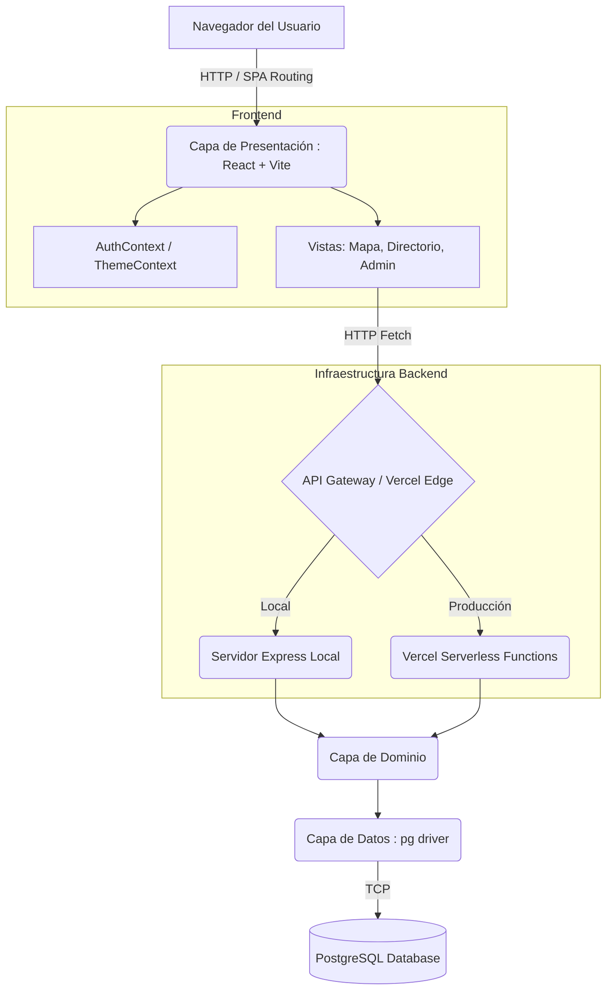

# Arquitectura del Sistema

El proyecto "Ministerio de Cultura de Panamá" está diseñado en base a los principios de **Clean Architecture** (Arquitectura Limpia), combinada con un enfoque híbrido de despliegue que soporta tanto un servidor monolítico como funciones Serverless.

## Visión General del Diseño

El sistema opera bajo un flujo de separación de responsabilidades estricto, aislando la interfaz de usuario de las reglas de negocio y de los canales de persistencia de datos (PostgreSQL).

### Capas Arquitectónicas

1. **Capa de Presentación (`src/presentation`)**:
   - Construida como una Single Page Application (SPA) utilizando **React** y **Vite**.
   - Gestiona todo el enrutamiento visual usando `react-router-dom`.
   - Incluye componentes visuales, páginas (Home, Mapa, Directorio) y Contextos de React (`AuthContext`, `ThemeContext`).
   - No contiene reglas de negocio.

2. **Capa de Dominio (`src/domain`)**:
   - Contiene la lógica central del negocio y los modelos de datos de la plataforma.
   - Es totalmente agnóstica a la base de datos o al framework de la interfaz usuaria.

3. **Capa de Datos (`src/data`)**:
   - Contiene las implementaciones para conexiones externas, particularmente consultas SQL seguras mediante la librería `pg` para PostgreSQL.

4. **Capa de Infraestructura y Servicios API (`src/server` y `api/`)**:
   - Expone los casos de uso a través del protocolo HTTP.
   - En **local**, opera como un servidor `Express.js` clásico.
   - En **producción**, opera empacado en enrutadores Serverless Vercel (`api/*.ts`).

## Diagrama de Componentes y Flujo de Datos



## Patrones de Diseño Implementados
- **Gestión de Estado Global**: Context API para el estado de autenticación (JWT) y preferencias del usuario (Dark Mode).
- **Backend For Frontend (BFF)**: Las serverless functions (como `/api/proxy`) se utilizan para evitar CORS y pre-procesar data antes de que llegue a React.

## Arquitectura de Almacenamiento (Storage)

Para organizar los archivos visuales y documentos a escala en un entorno de la nube (como AWS S3, Vercel Blob o Google Cloud Storage), el sistema utiliza una estructura jerárquica basada en el propietario (Ciudadano). Esto facilita la agrupación de recursos, la purga de datos por cumplimiento de privacidad y el control de acceso (CORS/CDN).

```text
/storage-root
│
├── /citizens
│   └── /{citizen_id}                  <-- ID (UUID) del Ciudadano en la base de datos
│       ├── /profile
│       │   └── avatar_{timestamp}.jpg <-- Foto de perfil de la cuenta base
│       │
│       ├── /documents
│       │   └── dni_{timestamp}.pdf    <-- Cédula, pasaporte u hoja de vida privada
│       │
│       └── /entities
│           └── /{entity_id}           <-- ID autoincremental de la Obra/Agente en Base de Datos
│               ├── /gallery
│               │   ├── feat_{hash}.jpg <-- La imagen "Destacada" (la primera que se subió)
│               │   ├── alt_{hash}.jpg  <-- Las demás imágenes secundarias
│               │   └── alt_{hash}.jpg
│               │
│               └── /certificates      <-- (A futuro) PDFs generados de Registro Público
│
├── /catalogs                          <-- (Opcional) Íconos o banners administrados por Backoffice
│   └── /sectors
│       └── sector_artes_visuales.png
│
└── /system
    └── /ui_assets                     <-- Logos estáticos del sitio, marcas compartidas, vacantes
```
