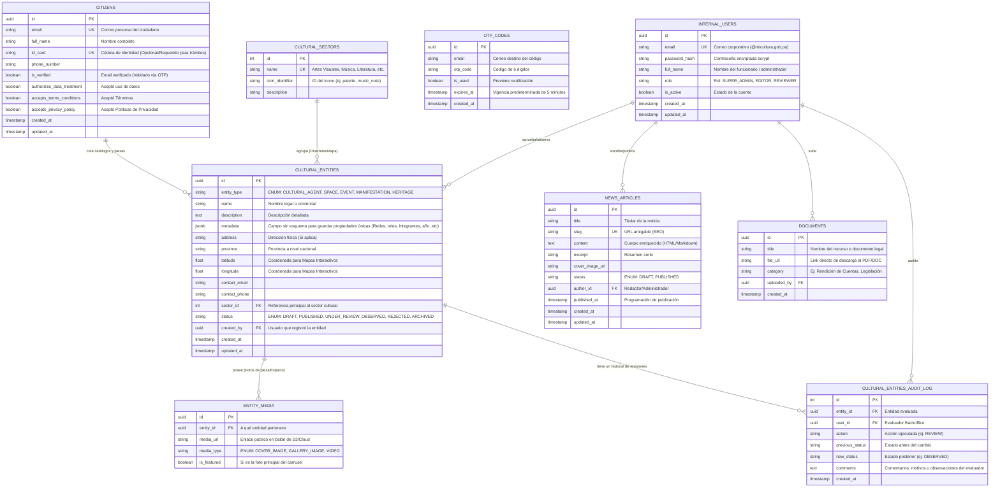

# Arquitectura de Datos (Diagrama Entidad-Relación)

Con base en los **Requerimientos Funcionales** levantados (Directorio Cultural, Mapas Interactivos, Gestión de Identidad y Novedades), este documento expone el diseño del esquema relacional que soporta la base de datos **PostgreSQL**.

## Diagrama Entidad-Relación (ERD)

Este modelo conceptual utiliza las convenciones de `Mermaid` para ilustrar las relaciones entre las entidades fundamentales requeridas por la plataforma del Ministerio de Cultura.

## Diccionario de Entidades Clave

1. **`INTERNAL_USERS` (Gestión Administrativa Interna):** 
   - Soporta exclusivamente a los funcionarios del Ministerio de Cultura. Tienen roles estrictos (`SUPER_ADMIN`, `EDITOR`) y son los únicos con permisos para publicar noticias, subir documentos legales y aprobar/rechazar/observar entidades culturales.
2. **`CITIZENS` (Público General / Creadores):**
   - Entidad apartada para los "ciudadanos de a pie" y creadores. Su cuenta les permite ingresar al Portal de Obras, proponer piezas culturales (obras de arte, artesanías, etc.), y enviarlas a revisión.
3. **`CULTURAL_SECTORS` (Sectores Culturales):**
   - Sirve como la tabla de catálogos estática para agrupar entidades bajo ramas específicas de arte (Música, Cine, Literatura). Soporta los carruseles de filtros y selectores en formularios.
4. **`CULTURAL_ENTITIES` (Entidades Culturales Polimórficas - "Las Obras"):**
   - **El corazón del sistema**. Representa simultáneamente a los "Agentes", "Espacios", "Manifestaciones", "Eventos" y sobre todo "Obras Registradas". 
   - En lugar de fragmentar múltiples tablas con datos idénticos (nombre, descripción, fotos, ubicación), usamos el campo `entity_type` (Single Table Inheritance).
   - **El campo clave `metadata` (JSONB)**: Este campo flexible sin esquema aloja de forma dinámica y ultra veloz arreglos y objetos complejos específicos por cada categoría sin modificar las columnas (Ej. *Integrantes, Redes Sociales, Técnicas, Medidas, Año de Creación*, etc).
5. **`ENTITY_MEDIA` (Multimedia):**
   - Almacena las URL de las fotografías asociadas a cualquier Obra/Entidad. Reemplaza el enfoque de campo único para que una obra pueda tener galerías infinitas.
6. **`CULTURAL_ENTITIES_AUDIT_LOG` (Historial de Auditoría):**
   - Almacena el rastro bidireccional de estados de una obra. Por ejemplo, documenta exactamente el motivo de rechazo (campo `comments`) cuando un usuario de Backoffice transforma el estado de una obra ciudadana de `UNDER_REVIEW` hacia `OBSERVED`.

## Recomendaciones a Nivel Infraestructura (DB)
- Configurar índices del tipo `B-TREE` en las columnas `entity_type` y `sector_id` de la tabla `CULTURAL_ENTITIES`.
- Crear índices `GIN` (*Generalized Inverted Index*) sobre la columna `metadata` en PostgreSQL, habilitando que consultas de backend avancen filtrando rápidamente valores internos anidados en JSON.
- Incorporar indexación geoespacial (`PostGIS`) para las columnas de coordenadas solo si es necesario a gran escala en un futuro. En el volumen actual, campos flotantes tradicionales son óptimos.
