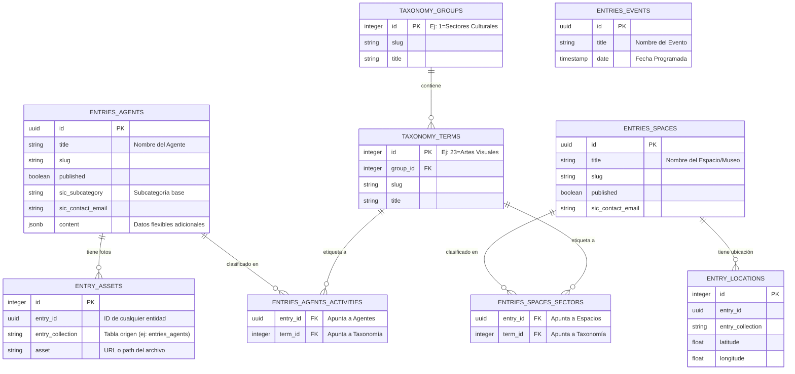

# Estructura del Esquema Heredado (backup_legacy)

Este documento describe la estructura relacional de la base de datos heredada del Sistema de Información Cultural (Sicultura), la cual ha sido exportada al esquema `backup_legacy` para consulta y procesos de migración (ETL) hacia el nuevo sistema.

## Conceptos Clave del Modelo Anterior

El sistema legacy fue diseñado utilizando un enfoque modular, en el que existen tablas independientes para cada tipo de entidad cultural, conectadas mediante tablas pivote a un sistema central de taxonomías y localidades.

Las principales diferencias constructivas frente a la base de datos moderna son:
1. **Múltiples Tablas Primarias:** En lugar de una sola tabla `cultural_entities` con una columna `entity_type`, aquí existe una tabla específica para cada objeto (`entries_agents`, `entries_spaces`, `entries_events`, etc.).
2. **Normalización por Taxonomías:** Categorías, áreas, sectores y etiquetas no son campos directos. Toda clasificación reside en `taxonomy_groups` y `taxonomy_terms`, enlazadas mediante tablas "sectores", "regiones" o "actividades".
3. **Módulo de Multimedia Externo:** Cada fotografía o archivo se enlaza de forma polimórfica inversa desde la tabla `entry_assets` hacia la tabla original usando el par `(entry_id, entry_collection)`.

---

## Diagrama Entidad-Relación (ERD)

Este diagrama conceptual ilustra la interconexión de las tablas principales, ejemplificando cómo el sistema estructuraba los Agentes y los Espacios, entrelazados con sus sectores y archivos multimedias correspondientes. 

*(Nota: Existen entidades adicionales como `entries_programs` o `entries_news` que siguen este mismo patrón arquitectónico de vinculación).*

## Tablas de Origen a Extraer (Mapeo de ETL sugerido)

Para poblar nuestra nueva tabla maestra de `cultural_entities`, el proceso de extracción de datos (ETL) deberá escanear y transformar registros desde las siguientes tablas:

| Tabla Origen (Legacy) | Entidad Destino Equivalente (`entity_type`) |
| :--- | :--- |
| `entries_agents` | `CULTURAL_AGENT` |
| `entries_spaces` | `SPACE` |
| `entries_manifestations` | `MANIFESTATION` / `HERITAGE` |
| `entries_events` | `EVENT` |

De igual forma, para completar la información pública de Novedades y Documentación:

| Tabla Origen (Legacy) | Tabla Destino (Nuevo Sistema) |
| :--- | :--- |
| `entries_news` | `min_cultura.news_articles` |
| `entries_documents` | `min_cultura.documents` |
| `taxonomy_terms` (Sectores) | `min_cultura.cultural_sectors` |
